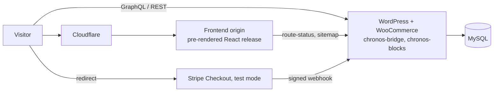

<p align="center">
  <a href="https://github.com/Zahidulislam2222/Chronos/actions/workflows/ci.yml"></a>
  <a href="https://github.com/Zahidulislam2222/Chronos/actions/workflows/security.yml"></a>
  <a href="https://github.com/Zahidulislam2222/Chronos/actions/workflows/codeql.yml"></a>
  
  
  
  
  
  
</p>

# Chronos

**Open-source headless WordPress + WooCommerce storefront with a cinematic,
pre-rendered React frontend.**

A luxury-watch shop demo: React 18 + TypeScript on the front, WordPress +
WooCommerce as the headless CMS and commerce engine, connected through
WPGraphQL and a custom REST API. It includes real accounts, a persisted
contact inbox and a server-priced, idempotent Stripe **test** checkout.

<p align="center">
  <a href="https://chronos.zahidul-islam.com"><strong>Live demo</strong></a> ·
  <a href="docs/ARCHITECTURE.md">Architecture</a> ·
  <a href="docs/API.md">API</a> ·
  <a href="docs/SCALABILITY.md">Scaling to 1M+</a> ·
  <a href="docs/ROADMAP.md">Roadmap</a> ·
  <a href="#getting-started">Getting started</a>
</p>

> **What is real and what is a target.** The live demo works end to end:
> WordPress content, login, contact persistence and Stripe test payments
> were verified in September 2026 ([evidence](docs/VERIFICATION.md)). It runs
> on deliberately small free-tier hosting. **1M+ concurrent users and 99.9%
> availability are design targets** with a staged plan and exit criteria,
> not measured capacity. Products are fictional, and no real money moves.

---

## Features

**Storefront (React 18, TypeScript, Vite 7)**
- Cinematic scroll-driven hero films with reduced-motion and failed-media fallbacks
- Build-time pre-rendering: real HTML, per-route metadata, JSON-LD, sitemap. Crawlable without JavaScript
- Live WooCommerce catalogue, WordPress posts, pages and menus
- JWT accounts with order history; guest cart kept across login
- Hosted Stripe Checkout (test mode) with **server-side pricing**, idempotency and payment reconciliation
- Real HTTP 404s for drafts and missing routes
- Accessibility: keyboard flows, skip link, labelled controls, reduced motion; 0 violations in 6 automated axe scans (not a full WCAG audit)

**Backend (WordPress plugins, PHP 8.1+)**
- **chronos-bridge** v2.1.0: OOP plugin with PSR-4 autoloading, custom REST API, Stripe checkout and webhooks, contact inbox with rate limiting, WooCommerce fields, JSON-LD, privacy exporter/eraser, Redis-ready caching, i18n, WP 7.0 AI admin helpers
- **chronos-blocks** v1.0.0: Watch Showcase, Collection Grid and Contact Form Gutenberg blocks

**Engineering**
- CI on pushes to `main` and every PR: PHPCS + PHPUnit, blocks lint/build/Jest, frontend typecheck/lint/pre-render/release check
- npm and Composer audits, CodeQL, Dependabot
- Hardened container release: read-only, non-root, dropped capabilities, CSP, HSTS, request budget
- Local-first releases with SHA-256 local/live parity proof

## Architecture



| Layer | Technology |
|---|---|
| Frontend | React 18, TypeScript 5, Vite 7, React Router 7, TanStack Query, Tailwind CSS, Framer Motion, Zod, DOMPurify |
| Backend | WordPress, WooCommerce, WPGraphQL (+ WooCommerce, JWT), PHP 8.1+, Stripe PHP SDK |
| Data | MySQL/MariaDB (WooCommerce + custom contact table) |
| Delivery | Docker Nginx container behind Caddy + Cloudflare (frontend); Nginx + PHP-FPM on a Google Cloud VM (backend) |
| Quality | PHPUnit, PHPCS (WordPress standards), Jest, ESLint, TypeScript, Playwright pre-render, CodeQL |

Details and design decisions: [docs/ARCHITECTURE.md](docs/ARCHITECTURE.md).

## Getting started

Requirements: Node.js ≥ 22.12, Docker (for WordPress), and optionally PHP 8.1+
with Composer.

### 1. Frontend only (preview mode, no backend)

```bash
git clone https://github.com/Zahidulislam2222/Chronos.git
cd Chronos
npm ci
npm run dev            # http://localhost:8080
```

Preview mode uses bundled demo content and blocks all external calls.

### 2. Full stack (WordPress + frontend)

**Backend:** follow the [Quick start in wordpress/README.md](wordpress/README.md#quick-start).
In order: Composer install for `chronos-bridge`, `docker-compose up -d`,
`bash setup.sh`, the GraphQL add-ons from GitHub releases, sample data, and
the blocks build. The sequence was tested from a fresh clone on 24 Sep 2026.

**Frontend in connected mode:**

```bash
cp .env.example .env.local
#   VITE_STOREFRONT_MODE=connected
#   VITE_API_URL=http://localhost:8888/graphql
#   VITE_WP_API_URL=http://localhost:8888
npm ci
npm run dev
```

| Service | URL |
|---|---|
| Frontend | http://localhost:8080 |
| WordPress admin | http://localhost:8888/wp-admin |
| GraphQL | http://localhost:8888/graphql |
| REST API | http://localhost:8888/wp-json/chronos/v1/ |
| phpMyAdmin | http://localhost:8081 |

Stripe: add **test** keys (`pk_test_…`, `sk_test_…`) and a webhook secret in
the Chronos settings page in wp-admin. Checkout refuses to run with live keys by design.

All frontend settings are listed in [`.env.example`](.env.example). Every
`VITE_*` value is public, so never put a secret there.

## Testing

```bash
npm run typecheck && npm run lint && npm run build && npm run verify:release
cd wordpress/wp-content/plugins/chronos-blocks && npm ci && npm test   # 19 Jest tests
cd ../chronos-bridge && composer install && vendor/bin/phpunit      # 38 tests, 60 assertions
vendor/bin/phpcs --standard=phpcs.xml --warning-severity=0
```

CI runs the same commands on pushes to `main` and every pull request. See
[CONTRIBUTING.md](CONTRIBUTING.md#run-the-same-checks-as-ci).

## Documentation

| Document | What it covers |
|---|---|
| [Architecture](docs/ARCHITECTURE.md) | Components, flows, design decisions, current limits |
| [API reference](docs/API.md) | REST and GraphQL endpoints, access rules, errors |
| [Deployment and CI/CD](docs/DEPLOYMENT.md) | Current VPS hosting, release process, workflows, hosting history (including the retired cPanel pipeline) |
| [Scalability](docs/SCALABILITY.md) | Workload model and the **target architecture for 1M+ concurrent users** |
| [Availability and DR](docs/AVAILABILITY-AND-DR.md) | 99% → 99.9% SLOs, error budgets, monitoring, incident response, backups, RPO/RTO |
| [Roadmap](docs/ROADMAP.md) | Phased plan with exit criteria, plus the real-commerce launch track |
| [Threat model](docs/THREAT-MODEL.md) | Assets, trust boundaries, STRIDE threats, controls, residual risk |
| [Security operations](docs/SECURITY-OPERATIONS.md) | Implemented controls, gates, operating limits |
| [Legal and compliance](docs/COMPLIANCE.md) | GDPR, ePrivacy, CCPA, PCI DSS, consumer law, accessibility, AI Act, CRA, licensing (not legal advice) |
| [Search, security and legal review](docs/SEARCH-SECURITY-LEGAL-REVIEW.md) | Detailed cited analysis |
| [Verification](docs/VERIFICATION.md) | Dated test and release evidence |
| [Public technical overview](https://docs.google.com/document/d/1vxOa2xT6dvLN1q8Mq0SWtN-BQWNdMcTfV9PLyzMkM5Y) | Client-facing summary (Google Doc) |

## Scalability and availability, in short

- **Today:** one frontend origin and one small backend VM. Honest and
  documented as a single point of failure.
- **Target:** 1M+ concurrent sessions with edge-cached HTML and GraphQL reads,
  stateless autoscaled PHP, Redis object cache, HA MySQL with replicas,
  queues, search service and multi-zone/DR. Includes capacity math, and the
  fact that **Stripe's default 25 req/s per-endpoint limit** caps checkout
  before WordPress does. See [SCALABILITY.md](docs/SCALABILITY.md).
- **Availability:** 99% objective (7 h 12 min/month budget) now, 99.9% after
  redundancy. It is measured with external probes, never assumed. See
  [AVAILABILITY-AND-DR.md](docs/AVAILABILITY-AND-DR.md).

## Security

- Server-side prices, an explicit `permission_callback` on every REST route (capability checks on admin routes), prepared SQL,
  DOMPurify, strict `script-src 'self'` CSP, HSTS, signed Stripe webhooks
- No secrets in the repository; private-key detection in pre-commit hooks; CodeQL and dependency audits in CI
- Report vulnerabilities privately; see [SECURITY.md](SECURITY.md)

## Project structure

```
chronos/
├── src/                     React frontend (pages, components, config, content, hooks, lib)
├── scripts/                 prerender, release verification, capacity model, probes, server setup
├── config/                  build and operations settings (JSON)
├── deploy/shared-vps/       frontend container, Nginx, Caddy templates
├── docs/                    public documentation
├── wordpress/
│   ├── docker-compose.yml   local WordPress + MySQL + phpMyAdmin
│   ├── setup.sh, sample-data.sh, seed-connected.php
│   └── wp-content/plugins/
│       ├── chronos-bridge/        custom PHP plugin (GPL-2.0-or-later)
│       ├── chronos-blocks/        custom Gutenberg blocks (GPL-2.0-or-later)
│       └── wp-graphql-cors-master/ third-party CORS plugin (GPL-3.0)
└── .github/                 CI, security, CodeQL, templates, Dependabot
```

## Contributing

Issues and pull requests are welcome. Please read
[CONTRIBUTING.md](CONTRIBUTING.md) and the
[Code of Conduct](CODE_OF_CONDUCT.md). Changes are recorded in
[CHANGELOG.md](CHANGELOG.md).

## License

- Frontend and root files: **MIT**, see [LICENSE](LICENSE)
- `chronos-bridge` and `chronos-blocks` WordPress plugins: **GPL-2.0-or-later**
- Bundled `wp-graphql-cors`: **GPL-3.0** (third-party)

Details: [THIRD-PARTY-NOTICES.md](THIRD-PARTY-NOTICES.md). Campaign media is
AI-generated; products and brand are fictional.

---

<p align="center">Built by <a href="https://github.com/Zahidulislam2222">Zahidul Islam</a></p>
