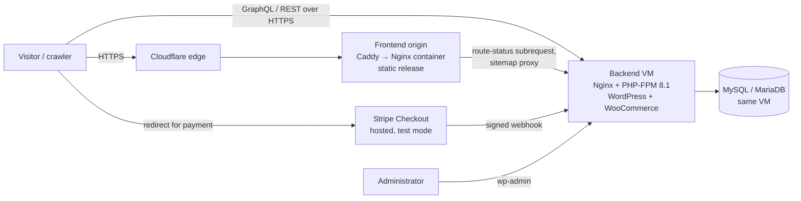

# Architecture

Chronos is a headless WordPress/WooCommerce storefront. A pre-rendered React
single-page application is the public frontend. WordPress is the content and
commerce backend, reached through WPGraphQL and a custom REST namespace.

This document describes the **current, deployed** system. The future
large-scale design is in [SCALABILITY.md](SCALABILITY.md), and the staged plan
is in [ROADMAP.md](ROADMAP.md).

## System context



| Component | Where it runs today | Responsibility |
|---|---|---|
| Frontend release | Existing VPS, Docker Nginx container behind Caddy HTTPS and Cloudflare — https://chronos.zahidul-islam.com | Serves pre-rendered HTML, hashed JS/CSS, images, fonts and films; validates dynamic routes |
| WordPress backend | Google Cloud e2-micro VM (always-free tier), Nginx + PHP-FPM 8.1, Let's Encrypt | Products, prices, stock, orders (WooCommerce); posts, pages, menus, media; accounts; contact inbox |
| Database | MySQL/MariaDB on the same backend VM | All WordPress/WooCommerce data plus the custom contact table |
| Payments | Stripe Checkout (hosted page), **test mode only** | Card entry and payment; Chronos never receives card data |
| CI | GitHub Actions | Tests, lint, build, dependency audits and CodeQL on pushes to `main` and every pull request |

The backend hostname is `chronosbackend.35-222-94-93.sslip.io`. sslip.io maps
the hostname to the VM's current public IP. That IP is ephemeral, so stopping
the VM changes the hostname. Replacing it with a static IP and an owned domain
is on the [roadmap](ROADMAP.md).

## Frontend

- **Stack:** React 18, TypeScript 5, Vite 7, React Router 7, TanStack Query,
  Tailwind CSS, Framer Motion, Zod.
- **Rendering:** `npm run build` runs `vite build`, then
  `scripts/prerender.mjs` uses a headless Chromium to write a real HTML
  document for every maintained route (title, description, canonical, social
  and JSON-LD metadata). Crawlers and no-JavaScript browsers get meaningful
  content; React then takes over in the browser.
- **Modes:** `VITE_STOREFRONT_MODE=preview` uses bundled demo content and
  blocks every external mutation. `connected` reads live WordPress data and
  enables login, contact and test checkout. The payment and authentication
  modules are lazy-loaded only in connected mode.
- **Configuration:** eight public `VITE_*` settings are validated by Zod in
  `src/config/settings.ts` and documented in `.env.example`. Nothing secret
  can be placed in the bundle; every `VITE_*` value is public by design.
- **Content ownership:** WordPress owns products, posts, pages and navigation.
  `src/content/*.json` owns only cinematic campaign copy, UI messages and
  fictional media references.
- **Safety:** CMS HTML is sanitised with DOMPurify. Media and link URLs are
  checked against allowed origins and schemes. Checkout redirects only to the
  fixed Stripe Checkout origin.

### Routes

| Route | Source |
|---|---|
| `/`, `/shop`, `/product/:slug` | WooCommerce catalogue via WPGraphQL |
| `/blog`, `/blog/:slug` | WordPress posts |
| `/about`, `/privacy`, `/terms`, `/accessibility`, other slugs | WordPress pages (connected mode) |
| `/cart`, `/checkout`, `/checkout/success` | Local selection + server-priced Stripe test checkout |
| `/account`, `/my-account` | JWT login, order history |
| `/contact` | Validated, rate-limited contact submission |

Unknown or draft routes return a **real HTTP 404**. The frontend Nginx asks
the backend's `route-status` endpoint before serving the application shell,
so drafts and missing records are never served as `200`.

## Backend

### chronos-bridge (custom plugin, v2.1.0, GPL-2.0-or-later)

An object-oriented PHP 8.1+ plugin with PSR-4 autoloading (`src/`):

| Module | Responsibility |
|---|---|
| `Api/` | `watches`, `contact`, `site`, `page`, `sitemap`, `route-status` REST endpoints |
| `Payment/` | Server-priced Stripe Checkout sessions, session verification, signed webhook |
| `WooCommerce/` | Checkout settings and custom order fields (gift wrap, delivery notes) |
| `GraphQL/` | `submitChronosContact` mutation and custom fields |
| `Database/` | Custom contact table, migrations, rate limiting |
| `Security/` | Sanitisation, capability and nonce helpers |
| `Privacy/` | WordPress personal-data exporter and eraser hooks |
| `SEO/`, `Analytics/`, `AI/`, `Cron/`, `Cache/`, `I18n/`, `PostTypes/`, `Admin/` | Supporting modules (the AI and analytics modules are retained but not exercised by the verified storefront flows) |

### chronos-blocks (custom plugin, v1.0.0, GPL-2.0-or-later)

Three Gutenberg blocks (Watch Showcase, Collection Grid, Contact Form), built
with `@wordpress/scripts` and tested with Jest.

### Third-party plugins

WooCommerce, WPGraphQL, WPGraphQL for WooCommerce, WPGraphQL JWT
Authentication and ACF are **installed on the server, not stored in this
repository**. `wp-graphql-cors` (GPL-3.0) is vendored in
`wordpress/wp-content/plugins/wp-graphql-cors-master/` for CORS handling.

## Key flows

### Checkout (test mode)

```mermaid
sequenceDiagram
    participant B as Browser
    participant W as WordPress (chronos-bridge)
    participant S as Stripe
    B->>W: POST /stripe/create-session {product IDs, quantities} + JWT
    W->>W: Resolve prices and stock from WooCommerce,<br/>idempotency key + MySQL lock, create order
    W->>S: Create Checkout Session (test key)
    S-->>W: session URL
    W-->>B: session URL (checkout.stripe.com only)
    B->>S: Redirect, customer pays on Stripe's page
    S-->>B: Redirect to /checkout/success
    B->>W: POST /stripe/verify-session
    W->>S: Retrieve session
    W->>W: Check owner, amount, currency, payment state;<br/>persist paid status before answering
    W-->>B: paid = true
```

The browser never sends prices. Checkout only runs with `sk_test`/`pk_test` keys (live keys can be saved in settings, but checkout then reports itself unavailable),
demo payments do not reduce stock, and no order emails are sent.

### Authentication

WPGraphQL JWT Authentication issues a token at login. The token is kept in
browser storage. Network failures keep the token; only an explicit
authentication rejection clears it. Order queries are scoped to the signed-in
customer. Browser-stored tokens remain an XSS-sensitive boundary, mitigated
(not eliminated) by sanitisation and the Content Security Policy — see
[THREAT-MODEL.md](THREAT-MODEL.md).

## Architecture decisions

| Decision | Why | Trade-off |
|---|---|---|
| Headless WordPress | Editors keep the WordPress admin; the frontend is free to be a cinematic SPA | Two systems to deploy and secure |
| Build-time pre-rendering | Crawlable HTML without running a Node server per request; the release is static and replicable | New CMS routes get the application shell, not a fresh snapshot, until the next build |
| Hosted Stripe Checkout (redirect) | Card data never touches Chronos; smallest PCI scope | Less control over the payment page design |
| Server-side pricing and idempotency | The browser cannot change amounts or double-create orders | Extra database lock per checkout |
| Route validation at the frontend origin | Correct 404s for drafts and missing records | Each dynamic route costs one backend subrequest |
| Local-first releases with SHA-256 parity | Live never drifts ahead of source; every release is auditable | Manual promotion step |
| Configuration in typed settings and data files | Changing URLs, limits or copy needs no code change | More files to maintain |

## Known limits of the current topology

- **Single points of failure:** one frontend origin, one backend VM, one
  database on that VM. There is no failover.
- **Small backend:** e2-micro has 2 shared vCPUs and 1 GB RAM (plus 2 GB
  swap). It is suitable for a demo, not for sustained real traffic.
- **Ephemeral backend IP**, tied to the sslip.io hostname.
- **No automated off-server backups today** (see
  [AVAILABILITY-AND-DR.md](AVAILABILITY-AND-DR.md)).

These limits are stated deliberately. The path beyond them is in
[SCALABILITY.md](SCALABILITY.md).
