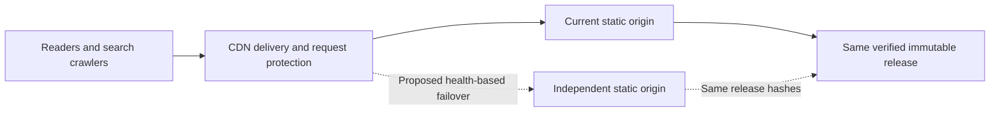

# Scalability and Availability Engineering

**Architecture goal: a delivery path for 10,000–1,000,000 concurrent readers. Current status: design target, not verified production capacity. Availability objective:99% over a rolling 30-day window, not a measured SLA.**

This repository demonstrates the engineering boundary between a scalable static experience and the infrastructure needed to deliver it. The public Chronos demo has no server session, database lookup, API rendering or per-user server mutation in its browsing path. HTML is rendered once during the build. Product and journal content is maintained as validated data. Images, fonts, video and code are versioned release artifacts. User selection state stays on the visitor's device. These choices make the frontend replicable without shared session state.

The currently deployed topology still has one shared origin server. CDN distribution, process restart and rollback improve delivery and recoverability; they do not create origin redundancy. The repository does not use a 10k/1M badge or mark a target as a passed benchmark. The implementation and the validation plan are the evidence of engineering quality.

## Implemented foundations

| Concern | Repository evidence | Practical consequence |
|---|---|---|
| Rendering | `scripts/prerender.mjs`, maintained search/catalogue data | HTML generated at build time; no application renderer per request |
| State | Preview catalogue and browser selection | Identical anonymous release can be replicated across origins |
| Assets | Hashed JS/CSS; local compressed images, fonts and MP 4s | Long immutable caching for hashed bundles; reusable delivery artifacts |
| Isolation | Read-only non-root container, private bind, resource limits | Frontend resource use is bounded independently of other applications |
| Overload | Nginx aggregate request budget and timeouts | Origin sheds excess work; this guard is a limit, not claimed capacity |
| Recovery | Versioned release, health check, restart, local restore archive and rollback | Reproducible recovery from a release or process failure |
| Availability evidence | `scripts/check-availability.mjs` | Timestamped end-to-end observations without inventing an uptime percentage |
| Capacity evidence | `scripts/capacity-model.mjs`, local-only test tooling | Reproducible assumptions, latency/error observations and bounded testing |

## Delivery topology and extension point

The dashed origin and failover path are a deployment design, not provisioned resources. Scaling this static frontend means replicating the same release and routing requests, rather than rewriting UI components. A second origin should be in an independent failure domain, with its own capacity, health probes and release parity evidence. Its frontend requires no sticky session or application database replication. Any purchased routing, hosting or traffic capacity requires explicit budget approval before implementation.

The retained WordPress commerce system is outside this topology. Enabling real login, inventory, checkout or payments changes the capacity problem: authoritative prices, transactions, idempotency, database connection limits, asynchronous work, failure handling and payment security must be engineered and tested separately. Static read scalability must never be presented as transaction-processing scalability.

## Workload model

Run `npm run capacity:model`. The maintained assumptions live in `config/operations.json`, not marketing copy or backend logic. They describe 300-second sessions,5 HTML requests,25asset requests, and an illustrative 12MB of transfer per session. A 99% cache-hit ratio is a hypothetical scenario, not a measured cache ratio for the deployed site.

Using these assumptions,10,000 concurrent sessions represent about 33 session starts per second and 1,000 edge requests per second. At 1 million concurrent sessions the model becomes about 3,333 session starts per second,100,000 edge requests per second and 320 Gbps of delivered traffic. These are arithmetic estimates; actual media consumption, warm browser caches, geography and user behaviour change the numbers substantially.

Even 99% cache hits across all requests would leave about 1,000 origin requests per second in the 1 million-session scenario. The current aggregate origin guard is 100 requests per second plus a bounded burst, so that workload is not supported by the current origin policy. Default uncached HTML would be much worse: roughly 16,667 HTML requests per second under the same assumptions. The model deliberately exposes these limits so they cannot be hidden behind a CDN logo.

Cloudflare does not cache HTML by default. The present HTML policy is freshness-oriented and retains no-transform to prevent injected analytics. Media and hashed bundles have explicit cache policies. Before large-scale delivery, establish a hostname-scoped anonymous HTML cache rule or an equivalent verified static-edge hosting strategy. Confirm compatibility with no-transform, purge/version behaviour, correct 404status, noindex routes, security headers and zero personal content. Do not apply a shared-zone cache-everything rule to unrelated apps. [Cloudflare default cache behaviour](https://developers.cloudflare.com/cache/concepts/default-cache-behavior/).

At large audience sizes, serving long video through a general CDN also requires checking its current service terms and traffic allowances. This repository makes no claim that unbounded video delivery is free. Asset optimisation reduces bytes; it does not supply contractual traffic capacity.

## Required evidence by stage

| Stage | Infrastructure and test requirements | Acceptance evidence |
|---|---|---|
| Local smoke | Literal loopback only, bounded concurrency and requests | Error count, latency percentiles, throughput, exact test configuration |
| Representative origin | Dedicated isolated environment; same image, limits and release | CPU/memory/network saturation, warm/cold routes, origin overload and recovery |
|10k readers | Approved workload, representative media mix, multiple locations | Sustained latency/error targets, cache-hit ratio, egress and browser experience |
|100k readers | Verified edge policy, origin headroom and independent failover | Soak, cold-cache/revalidation, failed-origin and release-recovery scenarios |
|1M readers | Provider traffic capacity, distributed generators and funded redundancy | Representative sustained workload, failover under load, measured cost and SLO evidence |

A 'user' must be defined before testing: active sessions, open TCP connections, requests in flight and requests per second are different quantities. Tests must state think time, session length, cache state, device/geographic mix, request sizes, ramp shape, duration and failure threshold. A brief localhost benchmark cannot be extrapolated into a million-person concurrency claim.

`tests/local-capacity.test.mjs` is restricted to the literal 127.0.0.1HTTP address and capped at 50 workers/2,000 requests. It refuses public targets and redirects. This protects the shared production host. Its result belongs in ignored project evidence, with the scope label intact. Large distributed tests are intentionally not launched by an ordinary build or CI run.

## 99% availability objective

A 99% objective over 30 days has a 432-minute error budget:7 hours 12 minutes. Define success as expected HTTPS content within the configured timeout, not merely an open port. The probe checks the homepage, a catalogue deep link and the application health endpoint. It records each result and exits nonzero on failure.

Run `npm run monitor:once` from an independent always-on scheduler every configured 60 seconds. The script is available and tested; no external scheduling or paid monitoring service is implied. Running it only on the origin cannot detect the origin's own complete failure. Running it only on a laptop that loses power cannot provide continuous coverage.

Measurement requires at least the full reporting window, timestamped expected intervals and a policy for missing observations. Missing intervals are unknown, not automatic successes. Report coverage separately; do not calculate an impressive percentage from a handful of successful manual checks. A provider uptime statement is not this application's end-to-end availability history.

For failover, verify an alternate origin's release hashes and HTTPS health, switch traffic under controlled conditions, measure time to recovery, and restore the primary without serving mixed releases. For rollback, measure recovery from a deliberately failed candidate in an isolated environment. Document recovery-time and recovery-point objectives before claiming they were met. Static releases have no customer database to restore, but asset/version consistency still matters.

## Client handoff statement

“Chronos uses pre-rendered, stateless delivery with cacheable assets, isolated resource limits, versioned releases, health checks and repeatable verification. The repository includes explicit workload models and a staged validation plan toward 10k–1M concurrent readers. Current deployment measurements are reported separately; higher traffic and 99% availability remain objectives until representative load and monitoring evidence establish them.”

This statement describes the architecture and work actually present. It should accompany measured release evidence, not replace it.
