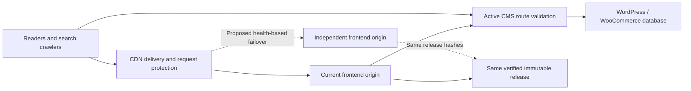
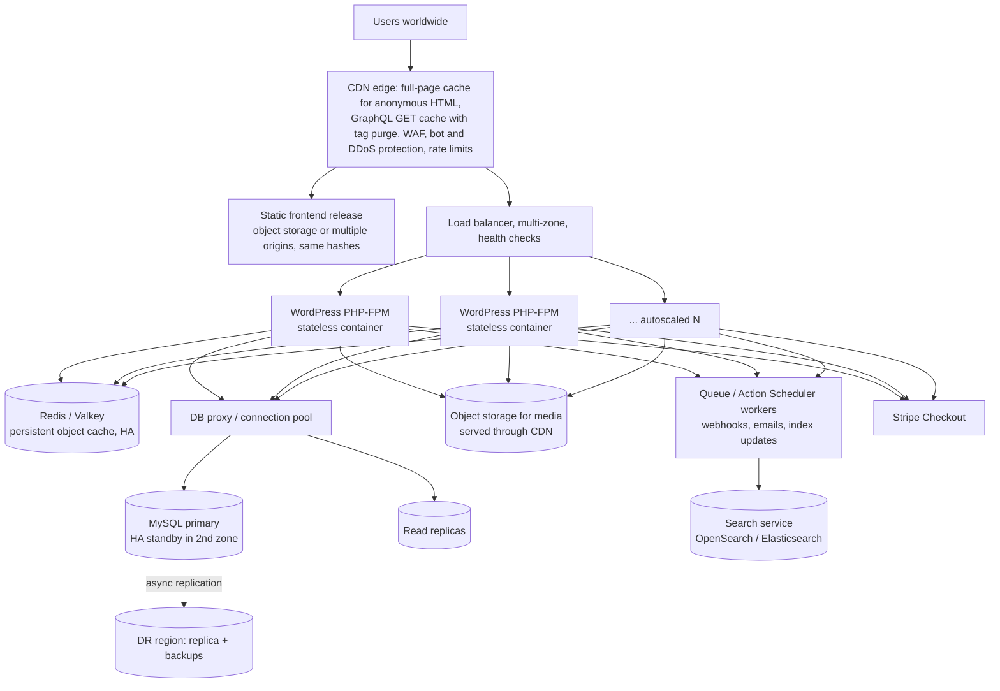

# Scalability and Availability Engineering

**Architecture goal: a path to 1,000,000+ concurrent users. Current status: design target, not verified production capacity. Availability objective: 99% over a rolling 30-day window, then 99.9% at scale. These are objectives, not a measured SLA.**

| | Today (facts) | Target (this document) |
|---|---|---|
| Topology | 1 frontend origin, 1 backend VM (e2-micro, 1 GB RAM), database on the same VM | Edge-cached frontend, autoscaled stateless PHP tier, HA database with replicas, shared cache, queues, multi-zone |
| Capacity evidence | Functional tests only; no load test of the connected stack | Staged distributed load tests at 10k → 100k → 1M (see the evidence table) |
| Availability evidence | Probe script exists; no continuous 30-day record | External multi-region probes and error-budget tracking ([AVAILABILITY-AND-DR.md](AVAILABILITY-AND-DR.md)) |

The first sections describe today's foundations and workload model. The
[target architecture](#target-architecture-for-1m-concurrent-users) section
describes how each bottleneck is removed. [ROADMAP.md](ROADMAP.md) turns it
into phases with exit criteria.

The public Chronos frontend now reads current WordPress/WooCommerce data. HTML snapshots and assets remain replicable, but browser API requests, authenticated operations and dynamic route-status checks reach the CMS/database. The static arithmetic below is an asset-delivery scenario, not a capacity measurement for the connected release. Initial HTML refreshes at build time; browser content and sitemap reflect CMS publication without rebuilding.

The currently deployed topology still has one shared origin server. CDN distribution, process restart and rollback improve delivery and recoverability; they do not create origin redundancy. The repository does not use a 10k/1M badge or mark a target as a passed benchmark. The implementation and the validation plan are the evidence of engineering quality.

## Implemented foundations

| Concern | Repository evidence | Practical consequence |
|---|---|---|
| Rendering | `scripts/prerender.mjs`, maintained search/catalogue data | HTML generated at build time; no application renderer per request |
| State | Preview catalogue and browser selection | Identical anonymous release can be replicated across origins |
| Assets | Hashed JS/CSS; local compressed images, fonts and MP4s | Long immutable caching for hashed bundles; reusable delivery artifacts |
| Isolation | Read-only non-root container, private bind, resource limits | Frontend resource use is bounded independently of other applications |
| Overload | Nginx aggregate request budget and timeouts | Origin sheds excess work; this guard is a limit, not claimed capacity |
| Recovery | Versioned release, health check (status only), restart on process exit, local restore archive and rollback | Reproducible recovery from a release or process failure |
| Availability evidence | `scripts/check-availability.mjs` | Timestamped end-to-end observations without inventing an uptime percentage |
| Capacity evidence | `scripts/capacity-model.mjs`; a maintainer-only local load test (kept outside the public repository) | Reproducible assumptions, latency/error observations and bounded testing |

## Delivery topology and extension point

The dashed origin and failover path are a deployment design, not provisioned resources. Scaling this static frontend means replicating the same release and routing requests, rather than rewriting UI components. A second origin should be in an independent failure domain, with its own capacity, health probes and release parity evidence. Its frontend requires no sticky session or application database replication. Any purchased routing, hosting or traffic capacity requires explicit budget approval before implementation.

WordPress is active behind this frontend topology. Real login, contact persistence and test checkout add database connections, authoritative prices, idempotency and provider work. Functional authorization/payment tests passed; capacity is unmeasured. Add API request frequency, route validation, anonymous cache/invalidation behavior and CMS/database resilience to the workload before sizing. Static read scalability must never be presented as transaction-processing scalability.

## Workload model

Run `npm run capacity:model`. The maintained assumptions live in `config/operations.json`, not marketing copy or backend logic. They describe 300-second sessions, 5 HTML requests, 25 asset requests, and an illustrative 12 MB of transfer per session. A 99% cache-hit ratio is a hypothetical scenario, not a measured cache ratio for the deployed site.

Using these assumptions, 10,000 concurrent sessions represent about 33 session starts per second and 1,000 edge requests per second. At 1 million concurrent sessions the model becomes about 3,333 session starts per second, 100,000 edge requests per second and 320 Gbps of delivered traffic. These are arithmetic estimates; actual media consumption, warm browser caches, geography and user behaviour change the numbers substantially.

Even 99% cache hits across all requests would leave about 1,000 origin requests per second in the 1 million-session scenario. The current aggregate origin guard is 100 requests per second plus a bounded burst, so that workload is not supported by the current origin policy. Default uncached HTML would be much worse: roughly 16,667 HTML requests per second under the same assumptions. The model deliberately exposes these limits so they cannot be hidden behind a CDN logo.

Cloudflare does not cache HTML by default. The present HTML policy is freshness-oriented and retains no-transform to prevent injected analytics. Media and hashed bundles have explicit cache policies. Before large-scale delivery, establish a hostname-scoped anonymous HTML cache rule or an equivalent verified static-edge hosting strategy. Confirm compatibility with no-transform, purge/version behaviour, correct 404 status, noindex routes, security headers and zero personal content. Do not apply a shared-zone cache-everything rule to unrelated apps. [Cloudflare default cache behaviour](https://developers.cloudflare.com/cache/concepts/default-cache-behavior/).

At large audience sizes, serving long video through a general CDN also requires checking its current service terms and traffic allowances. This repository makes no claim that unbounded video delivery is free. Asset optimisation reduces bytes; it does not supply contractual traffic capacity.

## Target architecture for 1M+ concurrent users

### What "1 million users" means

Three different numbers get called "1M users". The design must name which one:

| Meaning | Rough load (using `config/operations.json` assumptions) | Hardest part |
|---|---|---|
| 1M registered customers | Storage and indexes; traffic depends on activity | Database size, order history queries |
| 1M daily active users | ~12 new sessions per second on average; peaks several times higher | Peak-hour dynamic API traffic |
| **1M concurrent sessions** (this target) | ~3,333 session starts/s, ~100,000 edge requests/s, ~320 Gbps illustrative transfer | Edge delivery, origin shielding, checkout write path |

The rest of this section designs for **1M concurrent sessions**, the most
demanding meaning.

### Target topology

### Tier by tier

| Tier | Today | Target design | Why it is needed |
|---|---|---|---|
| **Edge / CDN** | Cloudflare proxy; HTML not edge-cached | Hostname-scoped cache rules for anonymous HTML; long-lived immutable asset caching; WAF managed rules; bot management; per-IP and per-route rate limits | At 1M sessions, 99% of requests must never reach an origin |
| **Frontend** | One Nginx container | Same immutable release on object storage/edge hosting or ≥2 origins in separate failure domains, health-based failover | The frontend is already stateless; scaling means replication, not code changes |
| **GraphQL / REST reads** | POST GraphQL, uncached | GraphQL **GET + persisted queries** so the CDN can cache them; WPGraphQL Smart Cache tag-based invalidation (`X-GraphQL-Keys`) to purge only affected queries on publish | Catalogue and editorial reads are the bulk of API traffic and are identical for anonymous users |
| **PHP application** | 1 VM, PHP-FPM | Stateless containers (no local uploads, no local sessions) behind a multi-zone load balancer; autoscaling on CPU and request latency; OPcache; WP-Cron replaced by system cron/workers | Horizontal scaling needs zero per-node state; JWT auth is already stateless |
| **Object cache** | No persistent object cache; transients stored in MySQL | Redis/Valkey persistent object cache (replicated), used by WordPress core and the `chronos-bridge` `Cache/` module (already written to be Redis-ready) | Removes repeated option, meta and query load from MySQL |
| **Database** | MySQL on the web VM | Managed MySQL with HA standby in a second zone, read replicas, read/write split (e.g. LudicrousDB/HyperDB), connection pooling proxy; WooCommerce **HPOS** order tables | The database is the hardest part to scale. HPOS gives orders dedicated indexed tables instead of `wp_posts` |
| **Media** | Uploads on the VM disk | Object storage + CDN; long video through a streaming/video service | Frees app nodes of state and egress |
| **Search** | SQL queries | Search service (OpenSearch/Elasticsearch, e.g. via ElasticPress) for catalogue search and filters | Faceted search on SQL does not scale |
| **Async work** | Inline in requests | Queue workers for Stripe webhooks, emails, cache purges, index updates; idempotent handlers | Keeps user-facing requests short; absorbs spikes |
| **Checkout** | Server-priced, idempotent, MySQL lock per customer request (user + request ID) | Same logic plus: queue-backed webhook processing, per-customer rate limits, Stripe limit increase, inventory reservation with expiry | The write path cannot be cached; see the math below |
| **Observability** | Probe script, container logs | Metrics (RED/USE), structured logs, OpenTelemetry tracing, real-user monitoring, multi-region synthetic probes, alert routing to on-call | You cannot scale or keep 99.9% on what you cannot see |
| **Regions** | 1 zone | Multi-zone primary region; warm DR region with replica and backups | Zone failure must not be an outage |

### Dynamic-tier capacity math (illustrative)

These numbers are **planning arithmetic with stated assumptions**, not
measurements. Replace them with measured values from the load tests.

| Step | Assumption | Result |
|---|---|---|
| API reads per session | 20 GraphQL/REST reads per 300 s session | 1M × 20 / 300 ≈ **66,700 API reads/s** at the edge |
| Edge hit ratio for API reads | 95% (GET + persisted queries + tag purge) | ≈ **3,300 origin reads/s** |
| PHP time per origin read | 50 ms with warm object cache | ≈ 170 busy PHP workers; ×2 headroom ≈ **340 workers** (e.g. 20–40 app containers depending on size) |
| Checkout starts | 1% of sessions start checkout during the session | 3,333 × 1% ≈ **33 checkout sessions/s** |
| Stripe limits | Default: 100 req/s global (live), **25 req/s per endpoint** ([Stripe rate limits](https://docs.stripe.com/rate-limits)) | 33 session creations/s already exceeds the default 25/s per-endpoint limit. **Request a limit increase from Stripe at least 6 weeks ahead**, as Stripe advises, and queue with back-off on `429` |
| Database writes | Each checkout: order insert + lock + meta; webhooks update later | Primary must sustain the write rate with HPOS; reads go to replicas and cache |

Takeaways:

1. The **edge hit ratio** is the single most important number. Each 1% of
   misses at 100,000 requests/s adds about 1,000 requests/s to the origin.
2. **Checkout is limited by the payment provider** before it is limited by
   WordPress. The provider limit is a contractual and operational item, not
   a code change.
3. **Static read scalability must never be presented as transaction
   scalability.** They are measured separately.

### Bottlenecks in today's code and their fixes

| Bottleneck | Where | Fix in target design |
|---|---|---|
| GraphQL over POST is uncacheable at the CDN | Frontend GraphQL client | Switch reads to GET + persisted queries; keep mutations POST |
| Route validation subrequest on every dynamic route | `deploy/shared-vps/nginx.connected.template` (`__route_status`) | Cache route-status responses briefly at the edge/origin; purge on publish |
| No persistent object cache | Backend VM | Enable Redis/Valkey object cache |
| WP-Cron triggered by page loads | WordPress default | System cron / dedicated workers |
| Uploads on local disk | Backend VM | Object storage offload |
| Single MySQL on the web host | Backend VM | Managed HA MySQL + replicas |
| Ephemeral IP + sslip.io hostname | Backend DNS | Static IP/load balancer and an owned domain |

### Cost

Moving beyond the free tier costs money: load balancers, managed database,
Redis, CDN features (WAF, cache rules, bot management), egress, object storage,
monitoring and on-call. Prices change and depend on region, commitment and
traffic mix. This repository therefore gives **no dollar figure**. Each
roadmap phase must be priced with the providers' current calculators and
approved before anything is provisioned.

## Required evidence by stage

| Stage | Infrastructure and test requirements | Acceptance evidence |
|---|---|---|
| Local smoke | Literal loopback only, bounded concurrency and requests | Error count, latency percentiles, throughput, exact test configuration |
| Representative origin | Dedicated isolated environment; same image, limits and release | CPU/memory/network saturation, warm/cold routes, origin overload and recovery |
|10k readers | Approved workload, representative media mix, multiple locations | Sustained latency/error targets, cache-hit ratio, egress and browser experience |
|100k readers | Verified edge policy, origin headroom and independent failover | Soak, cold-cache/revalidation, failed-origin and release-recovery scenarios |
|1M readers | Provider traffic capacity, distributed generators and funded redundancy | Representative sustained workload, failover under load, measured cost and SLO evidence |

A 'user' must be defined before testing: active sessions, open TCP connections, requests in flight and requests per second are different quantities. Tests must state think time, session length, cache state, device/geographic mix, request sizes, ramp shape, duration and failure threshold. A brief localhost benchmark cannot be extrapolated into a million-person concurrency claim.

The maintainer's local load test (`test:capacity:local`, whose test file is kept in the git-ignored `tests/` folder and is not part of the public repository) is restricted to the literal 127.0.0.1 HTTP address and capped at 50 workers/2,000 requests. It refuses public targets and redirects. This protects the shared production host. Its result belongs in ignored project evidence, with the scope label intact. Large distributed tests are intentionally not launched by an ordinary build or CI run.

## 99% availability objective

A 99% objective over 30 days has a 432-minute error budget: 7 hours 12 minutes. Define success as expected HTTPS content within the configured timeout, not merely an open port. The probe checks the homepage, a catalogue deep link and the application health endpoint. It records each result and exits nonzero on failure.

Run `npm run monitor:once` from an independent always-on scheduler every configured 60 seconds. The script is available and tested; no external scheduling or paid monitoring service is implied. Running it only on the origin cannot detect the origin's own complete failure. Running it only on a laptop that loses power cannot provide continuous coverage.

Measurement requires at least the full reporting window, timestamped expected intervals and a policy for missing observations. Missing intervals are unknown, not automatic successes. Report coverage separately; do not calculate an impressive percentage from a handful of successful manual checks. A provider uptime statement is not this application's end-to-end availability history.

For failover, verify an alternate origin's release hashes and HTTPS health, switch traffic under controlled conditions, measure time to recovery, and restore the primary without serving mixed releases. For rollback, measure recovery from a deliberately failed candidate in an isolated environment. Document recovery-time and recovery-point objectives before claiming they were met. Static releases have no customer database to restore, but asset/version consistency still matters.

## Client handoff statement

“Chronos uses pre-rendered, stateless delivery with cacheable assets, isolated resource limits, versioned releases, health checks and repeatable verification. The repository includes explicit workload models and a staged validation plan toward 10k–1M concurrent readers. Current deployment measurements are reported separately; higher traffic and 99% availability remain objectives until representative load and monitoring evidence establish them.”

This statement describes the architecture and work actually present. It should accompany measured release evidence, not replace it.
