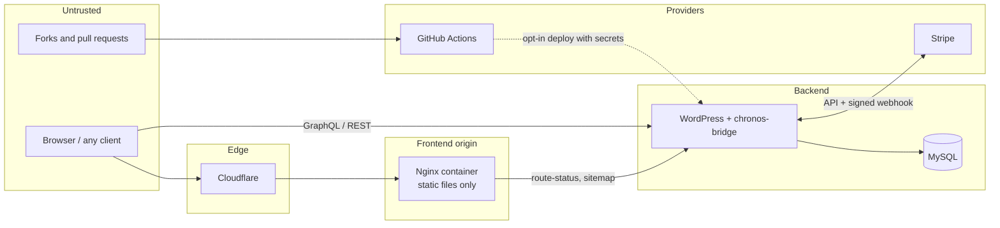

# Threat Model

Scope: the public storefront, the WordPress backend (`chronos-bridge`,
`chronos-blocks`, bundled `wp-graphql-cors`), Stripe test checkout, the CI
pipeline and the release process. Method: assets → trust boundaries → STRIDE
threats → controls → residual risk. Reviewed September 2026; review again
after any change to authentication, payments or hosting.

## Assets

| Asset | Why it matters |
|---|---|
| Customer accounts (email, password hash, JWT) | Account takeover, privacy harm |
| Orders and contact messages | Personal data; order integrity |
| Prices, stock, order payment state | Financial integrity |
| Server secrets (Stripe keys, webhook secret, JWT signing key, DB credentials, SSH keys, CI secrets) | Full compromise if leaked |
| Admin accounts | Full CMS control |
| Release integrity (frontend files, plugin files) | Supply-chain or defacement |
| Availability | Reputation, revenue at scale |

## Trust boundaries

## Threats and controls (STRIDE)

| # | Threat | Where | Controls in the code today | Residual risk |
|---|---|---|---|---|
| S1 | **Spoofing**: stolen JWT used to act as a customer | Browser storage | Tokens cleared on explicit rejection and sign-out; order queries scoped to the viewer; CSP limits script sources | JWT is script-readable. An XSS would expose it. Backlog: HttpOnly cookie or backend-for-frontend |
| S2 | Forged Stripe webhook | `/stripe/webhook` | Signature verification with the webhook secret | Secret must be rotated if exposed |
| S3 | Admin credential guessing | `wp-admin`, GraphQL login | WordPress password hashing | No MFA or login rate limiting documented for the backend. Phase 1: MFA for admins, login throttling at the edge |
| T1 | **Tampering**: browser changes prices | Checkout | Browser sends only product IDs and quantities; server resolves price and stock | None known |
| T2 | Replay or double submission creates duplicate orders | `/stripe/create-session` | Per-customer idempotency key, request fingerprint, MySQL lock | Tested functionally, not under concurrency load |
| T3 | Payment marked paid without payment | `/stripe/verify-session` | Checks owner, session, amount, currency and Stripe payment status; persists before answering | Test mode only; live mode needs re-verification |
| T4 | Malicious CMS HTML (stored XSS via editor content) | Rendered posts and pages | DOMPurify sanitisation; allowed link/media origins and schemes; strict `script-src 'self'` | `style-src 'unsafe-inline'` remains for the animation libraries |
| T5 | Tampered release or drift on the server | Deploys | Local-first releases, SHA-256 parity, immutable release directories | Manual process; relies on operator discipline |
| T6 | Malicious pull request steals CI secrets | GitHub Actions | Quality jobs need no secrets; deploy jobs run only on manual dispatch from `main` with an opt-in variable; `permissions: contents: read` | Workflow changes need careful review |
| R1 | **Repudiation**: disputes over orders or messages | Orders, contact | Records persisted with timestamps; Stripe keeps its own event log | No central audit log; phase 2 adds structured logs |
| I1 | **Information disclosure**: secrets in source or history | Repository | Secrets only in server config/env; `detect-private-key` pre-commit hook, maintainer-side gitleaks scanning, GitHub secret scanning with push protection; `.gitignore` covers env, wp-config, SQL, credentials | Full-history scan flags two **public sample keys** inside third-party `php-jwt` README files in an old commit (upstream documentation examples, not project credentials) |
| I2 | Backups exposed | CI artifacts | Artifact upload disabled for this public repository | No off-server backups until phase 1 |
| I3 | Error details leak internals | REST responses | Standard WP error objects; no stack traces returned | Keep `WP_DEBUG_DISPLAY` off in production |
| I4 | Direct-to-origin bypass of CDN protections | Frontend and backend origins | Loopback-bound container; Caddy only serves the configured hostname | Origin reachable with the right Host header; phase 2: origin allow-listing, authenticated origin pulls or tunnel |
| I5 | Contact inbox read by the public | `/contact` GET | `permission_admin` capability check on read/update/delete | None known |
| D1 | **Denial of service**: request floods | Frontend origin | Nginx aggregate budget 100 req/s + burst 250, body/timeouts limits, GET/HEAD only | The budget sheds load; it is not bot detection. Backend VM is small |
| D2 | Contact spam | `/contact` POST | Server-side rate limiting, length limits | No CAPTCHA; add edge rate limits at scale |
| D3 | Expensive GraphQL queries | `/graphql` | WPGraphQL defaults | Phase 2: persisted queries only for anonymous traffic, query depth/complexity limits |
| E1 | **Elevation of privilege**: missing capability checks | Custom REST routes | Every route declares a `permission_callback`: public routes explicitly, admin routes check `manage_options` / `manage_woocommerce` / `edit_posts`, checkout requires login | New routes must follow the same pattern (reviewed in PRs) |
| E2 | Vulnerable dependency | npm, Composer, WordPress plugins | `npm audit` / `composer audit` in CI, CodeQL, Dependabot configuration | Third-party WordPress plugins on the server are updated manually |
| E3 | Container breakout on the frontend host | Nginx container | Non-root UID 101, read-only root FS, all capabilities dropped, `no-new-privileges`, pids/memory/CPU limits | Shared host with other projects |

## Security testing performed

Recorded in [VERIFICATION.md](VERIFICATION.md): authorisation and input HTTP
checks (8), contact failure paths, repeated receipt checks, CSP injection
probe, header and 404 checks, dependency audits, secret scanning and a
fresh-context code review. **No external penetration test has been done.**
That is required before real commerce.

## Reporting

See [SECURITY.md](../SECURITY.md).
